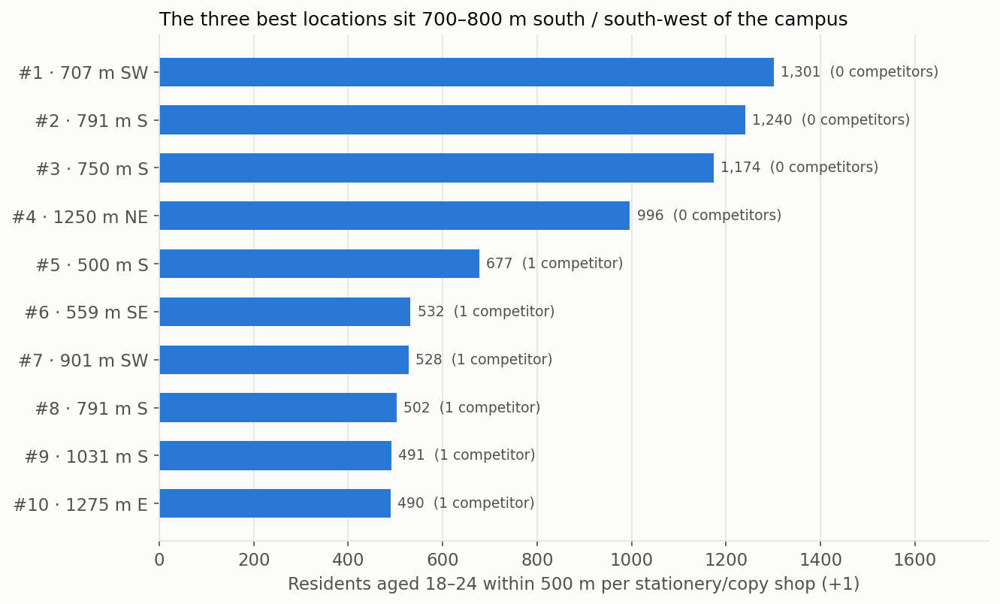
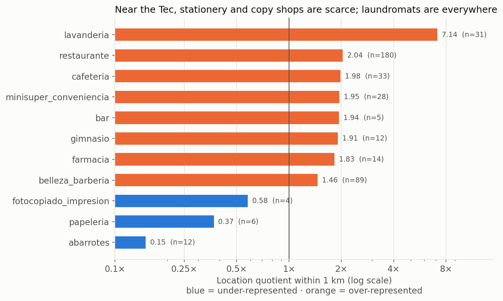

# What business should open near Tec de Monterrey? A site-selection analysis with INEGI data

> **Portfolio case study.** The client below is a simulated scenario. All data is public and comes from INEGI (Mexico's national statistics institute).
> 📊 **Interactive dashboard:** [Tableau Public](https://public.tableau.com/views/CampusMTYSiteSelection_/Dashboard1)
> 📄 **Business memo:** [English](docs/business_memo.md) · [Español](docs/memo_negocio.md)
> 🗺️ **Interactive maps:** [opportunity](https://ferflorwers25.github.io/campus-mty-site-selection/docs/map_opportunity.html) · [competition](https://ferflorwers25.github.io/campus-mty-site-selection/docs/map_tec.html)
> ✅ **Status:** complete (analysis, memo, maps and dashboard).

## Business problem

An entrepreneur wants to open a small business within walking distance of **Tec de Monterrey, Campus Monterrey**, an area with steady demand from students, staff and nearby residents. They have one question:

**Which type of student-oriented business is under-supplied around the campus, and where exactly should it go?**

## Questions this project answers

1. How many businesses of each type (cafés, stationery shops, gyms, laundromats, copy shops, etc.) are within 500 m, 1 km and 2 km of the campus?
2. Compared with the Monterrey metro area and with two other university zones (UANL Ciudad Universitaria, UDEM), which categories are **under- or over-represented** near the Tec? (location quotient)
3. Where are the **gaps**: blocks with high foot traffic potential but few competitors?
4. What is the final recommendation: which business, where, and with what risks?

## Data

| Source | What it contains | Use |
|---|---|---|
| [DENUE – INEGI](https://www.inegi.org.mx/app/mapa/denue/default.aspx) | Every registered business in Mexico: activity (SCIAN), size, coordinates | Supply / competition |
| Censo de Población y Vivienda 2020 – INEGI (by AGEB) | Population and age groups by urban block group | Demand |
| Marco Geoestadístico 2020 – INEGI | AGEB boundaries | Places census data on the map |

Raw data is not committed. It can be rebuilt with the scripts in `src/`.

## Method

- **Cleaning:** filter to the 9 metro municipalities, remove duplicate IDs, drop invalid coordinates, and map official activity names into business categories. Every step is logged in `data/processed/data_quality_report.txt`.
- **Distance:** haversine distance from every business to each campus.
- **Location quotient (LQ):** a category's share of businesses near the campus divided by its share across the metro. LQ < 1 means under-represented.
- **Benchmark:** the same metrics for UANL and UDEM, to separate "normal near universities" from "specific to the Tec."
- **Demand (phase 2):** 250 m grid around the campus. For each cell, residents aged 18–24 within a 500 m walk are estimated by areal interpolation of 2020 Census AGEBs.
- **Opportunity score:** residents aged 18–24 within 500 m ÷ (stationery + copy shops within 500 m + 1). It is checked against an alternative score that uses total population.

## Results

### Phase 2: where demand meets the gap



- Across the 1.5 km study area, the share of residents aged 18–24 (12.5%) matches Nuevo León (12.1%). The difference is concentration: around the three best cells it reaches **23–25%**, about twice the state level.
- The **three best locations sit 700–800 m south / south-west of the campus**. Each has 1,170–1,300 residents aged 18–24 within a 6-minute walk and **no stationery or copy shop** in that radius.
- **Robust:** 4 of the top 5 cells stay the same when scoring on total population instead of 18–24 year-olds.
- **Draft recommendation:** a combined stationery + print/copy shop in the top-ranked area south of the campus, pending field validation.
- 🗺️ [Interactive map](https://ferflorwers25.github.io/campus-mty-site-selection/docs/map_opportunity.html) · [notebook](notebooks/02_demand_and_opportunity.ipynb)

### Phase 1: supply



- DENUE lists **173,829 businesses** in the Monterrey metro, **926** of them within 1 km of Campus Monterrey.
- **Saturated:** laundromats (31 within 1 km, 7.1× the metro share), restaurants and cafés (~2×).
- **Scarce:** stationery (0.37×, 6 shops) and copy/print shops (0.58×, 4 shops). Around UANL, the same categories are *over*-represented (1.74× and 5.46×), so the gap is specific to the Tec area, not to universities in general.
- A 250 m grid flags candidate cells **south of the campus**: top-quartile commercial activity with no stationery or copy shop within 400 m.
- 🗺️ [Interactive map](https://ferflorwers25.github.io/campus-mty-site-selection/docs/map_tec.html)

Phase 1 alone was not enough to recommend anything (small counts, no demand data). Phase 2 above adds demand.

## Tech stack

Python (Pandas, NumPy, GeoPandas) · Jupyter · Folium (maps) · Tableau Public (dashboard)

## How to run

```bash
python -m venv .venv && source .venv/bin/activate
pip install -r requirements.txt
cd src
python download_denue.py      # downloads DENUE for Nuevo León
python build_study_area.py    # cleans data, computes distances and location quotients
python download_census.py     # downloads Census 2020 by AGEB + AGEB boundaries
python build_demand.py        # demand by grid cell + opportunity score
```

## Project structure

```
├── src/
│   ├── config.py              # campuses, radii, municipalities, categories
│   ├── download_denue.py      # data download
│   ├── build_study_area.py    # cleaning + distances + location quotients
│   ├── download_census.py     # Census 2020 + Marco Geoestadístico download
│   └── build_demand.py        # areal interpolation + opportunity score
├── sql/schema.sql             # draft PostgreSQL schema (not used yet)
├── notebooks/                 # exploration and analysis
├── dashboard/                 # Tableau Public link and screenshots
├── docs/                      # business memo
└── data/                      # raw/ and processed/ (gitignored)
```

## Roadmap

- [x] Project structure, download and cleaning pipeline
- [x] Phase 1: supply, competition by category and distance ring ([notebook](notebooks/01_exploration.ipynb))
- [x] Phase 2: demand, population by AGEB (Censo 2020)
- [x] Phase 3: opportunity score per grid cell and interactive map ([notebook](notebooks/02_demand_and_opportunity.ipynb))
- [x] [Tableau Public dashboard](https://public.tableau.com/views/CampusMTYSiteSelection_/Dashboard1) (data in [`dashboard/`](dashboard/))
- [x] One-page business memo ([EN](docs/business_memo.md) · [ES](docs/memo_negocio.md))

## Limitations

- DENUE lists registered establishments; informal businesses are under-counted.
- Campus coordinates are approximate centroids.
- Location quotients show relative supply, not profitability.
- The Census counts residents. Students who commute through the area are not captured.
- INEGI masks small AGEB counts (`*`). They are treated as unknown, which slightly under-estimates demand.
- Areal interpolation assumes people are evenly spread inside each AGEB.

## Author

**Fernando Flores**: Data Analyst · Backend · AI Automation · B.S. Innovation & Development Engineering, Tec de Monterrey (BI concentration)
[LinkedIn](https://linkedin.com/in/fffa)
